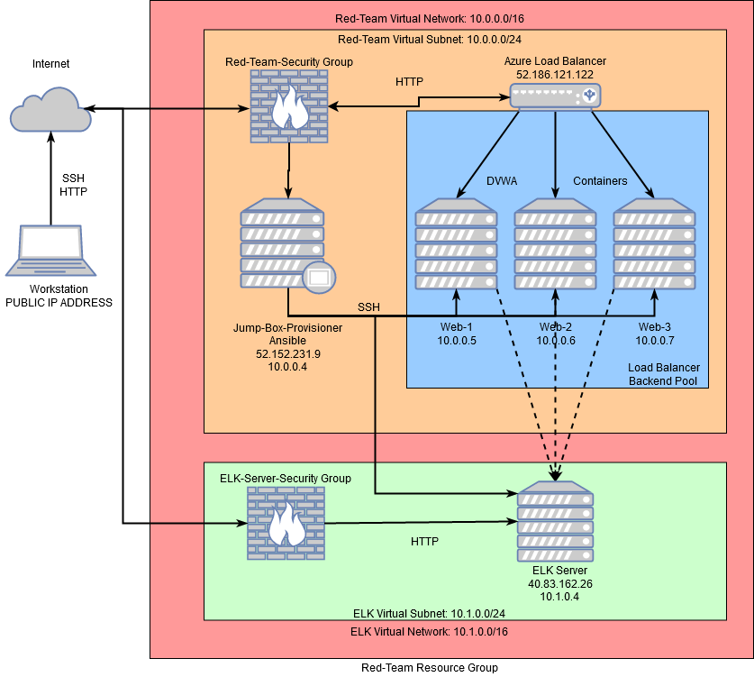
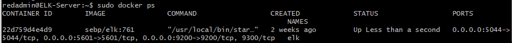

# NU-Cybersecurity-Bootcamp-Project1

## Automated ELK Stack Deployment

The files in this repository were used to configure the network depicted below.

These files have been tested and used to generate a live ELK deployment on Azure. They can be used to either recreate the entire deployment pictured above. Alternatively, select portions of the /Ansible/Playbooks/complete_playbook.yml file may be used to install only certain pieces of it, such as Filebeat.

This document contains the following details:
- Description of the Topology
- Access Policies
- ELK Configuration
  - Beats in Use
  - Machines Being Monitored
- How to Use the Ansible Build

### Description of the Topology

The main purpose of this network is to expose a load-balanced and monitored instance of DVWA, the D*mn Vulnerable Web Application.

Load balancing ensures that the application will be highly available, in addition to restricting traffic to the network.

Integrating an ELK server allows users to easily monitor the vulnerable VMs for changes to the log files and system metrics.

The configuration details of each machine may be found below.
| Name                 | Function       | Public IP Address | Private IP Address | Operating System |
|----------------------|----------------|-------------------|--------------------|------------------|
| Jump-Box-Provisioner | Gateway        | 52.152.231.9      | 10.0.0.4           | Linux            |
| Web-1                | Web Server     | None              | 10.0.0.5           | Linux            |
| Web-2                | Web Server     | None              | 10.0.0.6           | Linux            |
| Web-3                | Web Server     | None              | 10.0.0.7           | Linux            |
| ELK Server           | Log Monitoring | 40.83.162.26      | 10.1.0.4           | Linux            |

### Access Policies

The machines on the internal network are not exposed to the public Internet. 

Only the Jump-Box-Provisioner machine can accept connections from the Internet. Access to this machine is only allowed from the following IP addresses:
- [Workstation.IP]

Machines within the network can only be accessed by the Jump-Box-Provisioner, from the private IP address of 10.0.0.4.

A summary of the access policies in place can be found in the table below.

<<<<<<< HEAD
| Name                 | Publicly Accessible | Allowed IP Addresses         				|
|----------------------|---------------------|----------------------------------------------------------|
| Jump-Box-Provisioner | Yes                 | [Workstation.IP]:Port 22     				|
| Web-1                | No                  | 10.0.0.4            	    				|
| Web-2                | No                  | 10.0.0.4             	    				|
| Web-3                | No                  | 10.0.0.4             	    				|
| ELK Server           | No                  | [Workstation.IP]:Port 5601, 10.0.0.4:Port 22             |
=======
| Name                 | Publicly Accessible | Allowed IP Addresses         				         |
|----------------------|---------------------|-----------------------------------------------|
| Jump-Box-Provisioner | Yes                 | [Workstation.IP]:Port 22     				         |
| Web-1                | No                  | 10.0.0.4            	    				             |
| Web-2                | No                  | 10.0.0.4             	    				           |
| Web-3                | No                  | 10.0.0.4             	    				           |
| ELK Server           | No                  | [Workstation.IP]:Port 5601, 10.0.0.4:Port 22  |
>>>>>>> 595e74211f0eaeb7cf01bfb46335b4ef59b08fcf

### Elk Configuration

Ansible was used to automate configuration of the ELK machine. No configuration was performed manually, which is advantageous because saves time, prevents human error (i.e. typos), and allows us to deploy it on multiple machines very easily.

The playbook implements the following tasks:

- Download Docker image
- Download and install Python3
- Install Docker
- Increase and use more virtual memory
- Download and install Docker ELK Container

The following screenshot displays the result of running `docker ps` after successfully configuring the ELK instance.

### Target Machines & Beats
This ELK server is configured to monitor the following machines:

| Name  | IP Address |
|-------|------------|
| Web-1 | 10.0.0.5   |
| Web-2 | 10.0.0.6   |
| Web-3 | 10.0.0.7   |

We have installed the following Beats on these machines:
- Filebeat
- Metricbeat

| Name       | IP Address   |
|------------|--------------|
| Web-1      | 10.0.0.5     |
| Web-2      | 10.0.0.6     |
| Web-3      | 10.0.0.7     |
| ELK Server | 40.83.162.26 |

These Beats allow us to collect the following information from each machine:
- **Filebeat** monitors the log files or locations that we specify, collects log events, and forwards them either to Elasticsearch or Logstash for indexing. We can use Filebeat to collect, parse, and visualize ELK logs in a single command which in turn will help us better track our organizational goals. We expect to see information about the file system, including which files have changed and when.
- **Metricbeat** takes the metrics and statistics that it collects and ships them to the output that you specify, such as Elasticsearch or Logstash. We should expect to see information about CPU, memory, and disk usage.

### Using the Playbook
In order to use the playbook, you will need to have an Ansible control node already configured. Assuming you have such a control node provisioned: 

SSH into the control node and follow the steps below:
- Copy the elk-playbook.yml file to Ansible directory.
- Update the hosts file to include the webserver machines and the ELK machine.
- Run the playbook, and navigate to http://[ELKserverPublicIP]:5601/app/kibana to check that the installation worked as expected.
